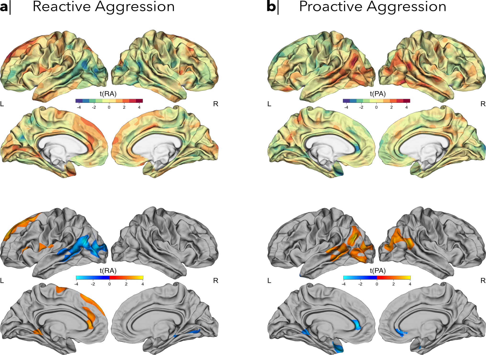
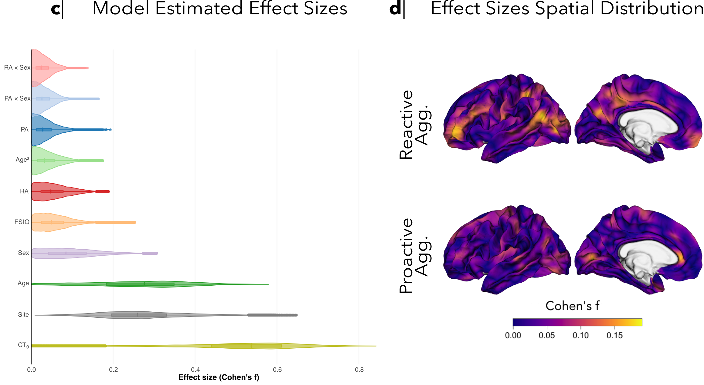
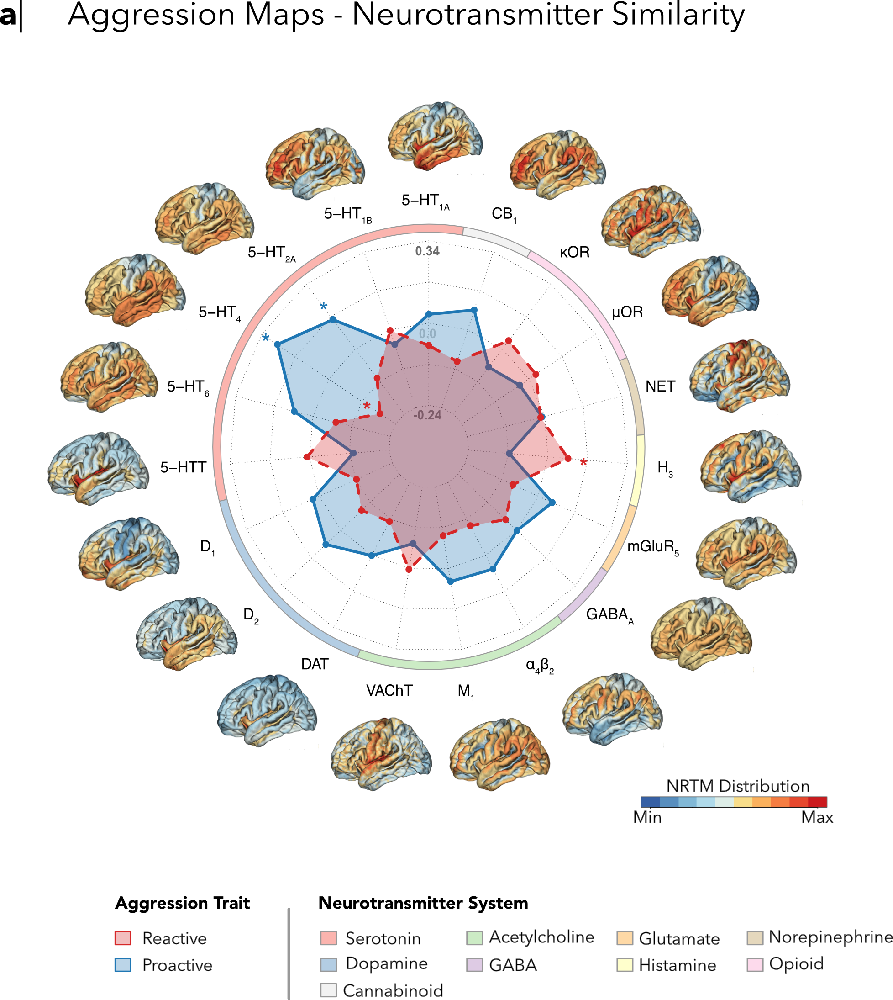
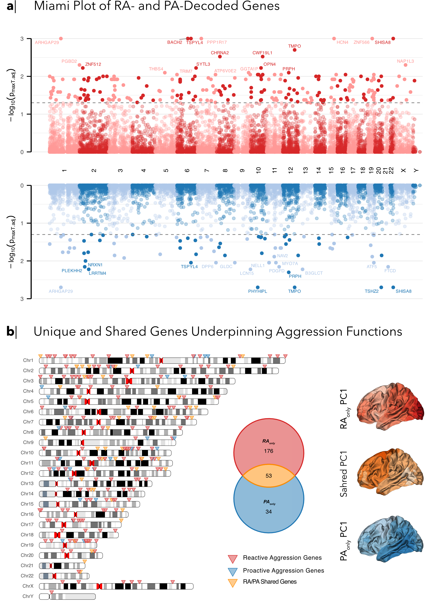
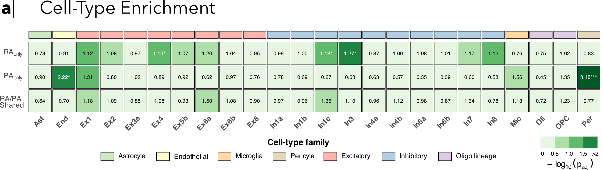

<section class="hero">
  

    
Poster Companion

    
Extended Data and Methods

    <h1 class="hero__title">Neuroanatomical and transcriptomic underpinnings of functional aggression subtypes</h1>
    
This site expands the analyses summarized on the poster and gives readers a fast, navigable overview of cohort information, MRI processing, statistical models, and downstream biological interpretation.

    

      Participants
      MRI Processing
      GLM Analysis
      Neuroreceptor Similarity
      Gene Decoding
      Functional Enrichment
    

  

  <aside class="hero__panel">
    
Author Team

    
Alessio Giacomel1,2,3, Wiebke Hennig1,2, Caroline Gurr1,2, Afsheen Kumar1,2, Johanna Leyhausen1,2, Hanna Seelemeyer1,2, Bassem Hermila1,2, Alexandre Jeanne1,2, Franziska Müller1,2, FemNAT-CD Consortium, Stephane De Brito4,5,6,7, Graeme Fairchild8, Kerstin Konrad9,10, Ute Habel11, Andreas G. Chiocchetti2, Christine M. Freitag2, Christine Ecker1,2,12

    

      
View affiliations

      

        
1 Cooperative Brain Imaging Centre (COBIC), University Hospital, Goethe University, Frankfurt am Main, Germany

        
2 Department of Child and Adolescent Psychiatry, University Hospital, Goethe University, Frankfurt am Main, Germany

        
3 Centre for Neuroimaging Sciences (CNS), Institute of Psychiatry, Psychology and Neurosciences (IoPPN), King's College London, London, UK

        
4 Centre for Human Brain Health, School of Psychology, University of Birmingham, Birmingham, United Kingdom

        
5 Institute for Mental Health, School of Psychology, University of Birmingham, Birmingham, United Kingdom

        
6 Centre for Developmental Science, School of Psychology, University of Birmingham, Birmingham, United Kingdom

        
7 Birmingham Centre for Neurogenetics, University of Birmingham, Birmingham, United Kingdom

        
8 Department of Psychology, University of Bath, Bath, United Kingdom

        
9 Child Neuropsychology Section, Department of Child and Adolescent Psychiatry, Psychosomatics and Psychotherapy, University Hospital RWTH Aachen, Aachen, Germany

        
10 JARA-Brain Institute II, Molecular Neuroscience and Neuroimaging, RWTH Aachen and Research Centre Jülich, Jülich, Germany

        
11 Department of Psychiatry, Psychotherapy and Psychosomatics, Faculty of Medicine, RWTH Aachen University, Aachen, Germany

        
12 Department of Forensic and Neurodevelopmental Sciences, Institute of Psychiatry, Psychology, and Neuroscience (IoPPN), King's College London, London, UK

      

    

  </aside>
</section>

<nav class="section-nav" aria-label="Page sections">
  <a href="#participants">Participants01</a>
  <a href="#mri-processing">MRI Processing02</a>
  <a href="#glm-analysis">GLM Analysis03</a>
  <a href="#neuroreceptor-similarity">Neuroreceptor Similarity04</a>
  <a href="#gene-decoding">Gene Decoding05</a>
  <a href="#functional-enrichment">Functional Enrichment06</a>
  <a href="#data-and-code-availability">Data and Code Availability07</a>
  <a href="#acknowledgments">Acknowledgments08</a>
  <a href="#contact">Contact09</a>
</nav>

<section class="section-card" id="participants" markdown="1">
  

    01
    

      <h2>Participants</h2>
      
Participants from the FemNAT-CD cohort included in the current study.

    

  

### Sample Overview
All subject data used in this study were obtained from the FemNAT-CD study, a multicenter study aimed at investigating sex differences in Conduct Disorders (CD).
Of the full sample, participants were included in the present study if 1) they had completed an MRI scan; 2) had available ancillary information for the analysis (i.e., age, biological sex), and 3) behavioral measures for full-scale intelligence quotient (FSIQ), measured with the Wechsler Abbreviated Scale of Intelligence 2nd edition (WASI-II), and aggressive behaviors.

Aggressive behaviors were assessed using the Reactive–Proactive Aggression Questionnaire (RPQ)11, a validated 23-item self-report instrument designed to distinguish between reactive and proactive aggression. The scale comprises two subscales, with items assessing impulsive, retaliatory aggression (reactive aggression - RA) and deliberate, goal-directed aggression (proactive aggression - PA). Participants rated each item on a three-point Likert scale ranging from 0 (never) to 2 (often). Individual items in each subscale were summed to obtain an RA and PA subscale score for each participant.

| Characteristic | Overall N = 670&dagger; | CD N = 279&dagger; | HC N = 391&dagger; | Test statistic | p-value2 |
| --- | --- | --- | --- | --- | --- |
| **Demographics** |  |  |  |  |  |
| Age (years) | 14.21 &plusmn; 2.49 [9-18] | 14.25 &plusmn; 2.41 [9-18] | 14.18 &plusmn; 2.55 [9-18] | W = 54906.00 | 0.883 |
| Sex |  |  |  | chi2 = 7.24, df = 1 | 0.006 |
| F | 345 (51%) | 126 (45%) | 219 (56%) |  |  |
| M | 325 (49%) | 153 (55%) | 172 (44%) |  |  |
| FSIQ | 100 &plusmn; 13 [68-138] | 95 &plusmn; 12 [68-128] | 104 &plusmn; 12 [70-138] | W = 32914.50 | &lt;0.001 |
| **Neuroimaging** |  |  |  |  |  |
| Acquisition Site |  |  |  | chi2 = 3.62, df = 4 | 0.459 |
| Aachen | 160 (24%) | 75 (27%) | 85 (22%) |  |  |
| Basel | 71 (11%) | 27 (9.7%) | 44 (11%) |  |  |
| Birmingham | 177 (26%) | 66 (24%) | 111 (28%) |  |  |
| Frankfurt | 139 (21%) | 59 (21%) | 80 (20%) |  |  |
| Southampton | 123 (18%) | 52 (19%) | 71 (18%) |  |  |
| Mean CT (mm) | 2.51 &plusmn; 0.10 [2.19-2.84] | 2.50 &plusmn; 0.10 [2.19-2.82] | 2.51 &plusmn; 0.10 [2.19-2.84] | W = 53207.50 | 0.588 |
| **RPQ Subscales** |  |  |  |  |  |
| PA Subscale | 2.21 &plusmn; 3.40 [0-19] | 4.01 &plusmn; 4.27 [0-19] | 0.93 &plusmn; 1.70 [0-11] | W = 82819.00 | &lt;0.001 |
| RA Subscale | 7.9 &plusmn; 5.1 [0-22] | 11.3 &plusmn; 5.1 [0-22] | 5.5 &plusmn; 3.6 [0-20] | W = 88920.50 | &lt;0.001 |

*Note:* Values are expressed as mean &plusmn; SD [range] or n (%). FSIQ = Full-Scale Intelligence Quotient Score; CT = Cortical Thickness; RPQ = Reactive Proactive Aggression Questionnaire; RA = Reactive Aggression; PA = Proactive Aggression. &dagger; n (%); mean &plusmn; SD [range]. 2 Pearson's chi-squared test; Wilcoxon rank sum test.

</section>

<section class="section-card" id="mri-processing" markdown="1">
  

    02
    

      <h2>MRI Processing</h2>
      
MRI acquisition and preprocessing procedures used to derive cortical-thickness measures for downstream analyses.

    

  

### MRI Acquisition

All participants underwent MRI scanning at one of five sites across Europe: Frankfurt, Basel, Birmingham, Aachen, and Southampton. Structural T1-weighted scans were acquired using either Siemens 3-Tesla MRI systems (Tim-Trio and Prisma) or a Philips 3-Tesla MRI system (Achieva) with magnetization-prepared rapid acquisition gradient-echo sequences. Scans were acquired with a 256 mm field of view and 1.1 x 1.1 x 1.1 mm resolution. Additional details on acquisition parameters and quality assessment procedures are reported in previous consortium publications 35-37.

### Preprocessing Workflow

Structural scans were processed with [FreeSurfer 6.0.0](http://surfer.nmr.mgh.harvard.edu/) to reconstruct cortical surfaces. The standard automated pipeline included intensity normalization, skull stripping, and reconstruction of the gray/white matter boundary and pial surface. Cortical thickness (CT) was computed at each cortical vertex as the average distance between the white matter surface and the closest point on the pial surface, and the resulting vertex-wise CT maps were smoothed with a 15 mm full width at half maximum (FWHM) Gaussian kernel. In addition, mean cortical thickness (CT0) across both hemispheres was computed for each participant.

</section>

<section class="section-card" id="glm-analysis" markdown="1">
  

    03
    

      <h2>GLM Analysis</h2>
      
Vertex-wise general linear modeling framework used to test associations between cortical thickness and reactive and proactive aggression.

    

  

### Model Overview

Vertex-wise generalized linear models (GLMs) were estimated with the [BrainStat Python toolbox](https://brainstat.readthedocs.io/en/master/) using cortical thickness as the outcome measure. The model included linear and quadratic age terms to capture potential nonlinear developmental effects, as well as sex, full-scale intelligence quotient (FSIQ), reactive aggression (RA), proactive aggression (PA), sex-by-RA and sex-by-PA interaction terms, acquisition site, and global mean cortical thickness (CT0).

$$
\begin{aligned}
\mathrm{CT} \sim\ & \beta_0 + \beta_1 \mathrm{age} + \beta_2 \mathrm{age}^2 + \beta_3 \mathrm{sex} + \beta_4 \mathrm{FSIQ} \\
& + \beta_5 \mathrm{RA} + \beta_6 (\mathrm{RA} \times \mathrm{sex}) + \beta_7 \mathrm{PA} + \beta_8 (\mathrm{PA} \times \mathrm{sex}) \\
& + \beta_9 \mathrm{site} + \beta_{10} \mathrm{CT}_0 + \varepsilon
\end{aligned}
$$

Aggression measures were derived from the Reactive-Proactive Aggression Questionnaire (RPQ). Site was included to account for systematic differences in data acquisition across imaging centers, and CT0 was included to control for overall individual differences in cortical thickness. To account for multiple comparisons across vertices, statistical maps were thresholded using random-field-theory-based cluster analysis for nonisotropic images, with a two-tailed cluster-level significance threshold of pclust &lt; 0.05.

### Results
Reactive aggression showed a marked left-lateralized association with cortical thickness (RFT-corrected p &lt; 0.05), as shown in the cortical-thickness maps below. Negative associations between RA and lower CT (blue-light blue; lower RA panel in the figure below) were most prominent in the left lateral posterior temporal cortex, spanning superior and middle temporal regions (approximately Brodmann areas [BA] 22/21) and extending toward the temporo-occipital junction (approximately BA 37/19). Positive associations between RA and higher CT (red-orange; upper RA panel in the figure below) were broader in extent and also predominantly left-lateralized, with peak effects in medial superior frontal cortex (approximately BA 8/9) and anterior cingulate cortex (approximately BA 24/32). Additional smaller thickening clusters were observed in left dorsolateral superior frontal and dorsal frontoparietal regions (approximately BA 8/9/6), as well as in left ventral occipito-temporal and medial occipital cortex in the lingual-parahippocampal vicinity (approximately BA 18/19 and BA 27/28/35/36).

Proactive aggression also showed significant associations with cortical thickness (RFT-corrected p &lt; 0.05), as shown in the cortical-thickness maps below, and was characterized by increased CT in lateral temporo-parietal regions together with lower CT in posterior-ventral cortex. Cortical thickening (red-orange; upper PA panel in the figure below) was most prominent in the left lateral posterior temporal cortex (approximately BA 22/21) and extended into the temporo-parietal junction and inferior parietal territory (approximately BA 39/40), with a smaller homologous cluster in the right posterior temporal cortex (approximately BA 22/21). In contrast, cortical thinning (blue-light blue; lower PA panel in the figure below) was observed on the medial surface, involving posterior midline cortex consistent with posterior cingulate and precuneus (approximately BA 23/31 and BA 7), and extended into ventral occipito-temporal and medial occipital regions in the lingual-parahippocampal vicinity (approximately BA 18/19 and BA 27/28/35/36), with an additional small cluster in the right ventral temporal cortex (approximately BA 37).

<figure class="content-figure">
  
</figure>

Vertex-level effect sizes (Cohen's f) for RA and PA were small overall, ranging from 0 to 0.189 (0.055 ± 0.037) and from 0 to 0.193 (0.035 ± 0.027), respectively, as shown in the effect-size figure below. The largest effect sizes for RA were observed along the medial frontal-parietal midline, with smaller maxima in dorsolateral frontal and temporo-parietal cortex (upper panel in the figure below). The largest effect sizes for PA were concentrated more posteriorly, with peak vertices in posterior medial cortex (medial parietal-occipital territory) and ventral occipito-temporal cortex, alongside secondary maxima in the temporo-parietal junction (lower panel in the figure below). Overall, effect sizes for the main effects of both forms of aggression were small relative to other model terms, as summarized in the same figure, including mean cortical thickness (CT0; f = 0.516 ± 0.137), acquisition site (f = 0.268 ± 0.09), age (f = 0.263 ± 0.116), and biological sex (f = 0.093 ± 0.062).

<figure class="content-figure">
  
</figure>

### Sensitivity Analyses

As sensitivity analyses, the GLM was re-estimated twice by additionally including either diagnostic group (CD vs HC) or ADHD comorbidity, to assess the stability of the identified clusters. ADHD comorbidity was defined as the presence of ADHD symptoms at any time point on the Kiddie Schedule for Affective Disorders and Schizophrenia - Present and Lifetime Version (K-SADS-PL) administered in the FemNAT-CD study.

Sensitivity analyses controlling for diagnostic group or comorbid ADHD showed that the spatial patterns of association were highly preserved relative to the primary model (t-map correlations, r = 0.94-0.99, pspin &lt; 0.001). 

add figure here!

Using the Dice coefficient to quantify overlap of the RFT cluster-corrected significant vertices, PA effects were essentially unchanged after adjustment for ADHD (Dice = 0.985), whereas adjustment for diagnostic group yielded a moderate reduction in overlap (Dice = 0.753). For RA, overlap was reduced when either covariate was included (Dice = 0.622 for ADHD; Dice = 0.704 for diagnostic group), suggesting that the overall spatial pattern was preserved while the number of surviving significant vertices was reduced.

add figure here!

</section>

<section class="section-card" id="neuroreceptor-similarity" markdown="1">
  

    04
    

      <h2>Neuroreceptor Similarity</h2>
      
Spatial correspondence analyses relating aggression-associated cortical maps to normative PET-derived receptor and transporter maps.

    

  

### Reference Maps and Similarity Analysis

To contextualize the cortical correlates of RA and PA within neurochemical architecture, we quantified spatial correspondence between each aggression-derived cortical effect map and a set of normative PET-derived neurotransmitter receptor and transporter maps. Reference maps were obtained from the [neuromaps List of Maps](https://netneurolab.github.io/neuromaps/listofmaps.html), and the set used here comprised 37 PET-derived maps spanning 19 receptor or transporter targets across nine neurotransmitter systems.

All reference maps were z-scored prior to analysis and resampled to the RA and PA t-maps. Medial wall vertices were excluded using a common cortical mask applied identically to the aggression maps, receptor maps, and surrogate maps. Spatial correspondence between each aggression map and each receptor map was quantified using Pearson correlation across cortical vertices. Statistical significance was evaluated using spatial autocorrelation-preserving surrogate maps generated with a variogram-matching null model. Two-tailed p-values were computed as the proportion of null correlations with absolute value greater than or equal to the observed correlation. For each aggression map, the k-nearest-neighbor parameter was selected by evaluating k in {1000, 4000, 10000} with 100 preliminary surrogates, after which the selected k was used to generate 1000 surrogates for inference.

The reference maps included in the current analysis are listed below.

| System | Target | Tracer | N Subjects | Study |
| --- | --- | --- | ---: | --- |
| Acetylcholine | A4B2 | [18F]Flubatine | 30 | (Hillmer, 2016) |
| Acetylcholine | M1 | [11C]LSN3172176 | 24 | (Naganawa, 2020) |
| Acetylcholine | VAChT | [18F]FEOBV | 18 | (Aghourian, 2017) |
| Acetylcholine | VAChT | [18F]FEOBV | 5 | (Bedard, 2019) |
| Acetylcholine | VAChT | [18F]FEOBV | 4 | (Tuominen, N.D.) |
| Cannabinoid | CB1 | [18F]FMPEP-d2 | 22 | (Laurikainen, 2018) |
| Cannabinoid | CB1 | [11C]OMAR | 77 | (Normandin, 2015) |
| Dopamine | D1 | [11C]SCH23390 | 13 | (Kaller, 2017) |
| Dopamine | D2 | [18F]Fallypride | 49 | (Jaworska, 2020) |
| Dopamine | D2 | [11C]FLB457 | 55 | (Sandiego, 2015) |
| Dopamine | D2 | [11C]FLB457 | 37 | (Smith, 2017) |
| Dopamine | D2 | [11C]Raclopride | 7 | (Alarkurtti, 2015) |
| Dopamine | DAT | [18F]FE-PE2I | 6 | (Sasaki, 2012) |
| Dopamine | DAT | [123I]FP-CIT | 174 | (Dukart, 2018) |
| GABA | GABAA | [11C]Flumazenil | 6 | (Dukart, 2018) |
| GABA | GABAA | [11C]Flumazenil | 16 | (Norgaard, 2021) |
| Glutamate | mGluR5 | [11C]ABP688 | 28 | (DuBois, 2015) |
| Glutamate | mGluR5 | [11C]ABP688 | 22 | (Rosa-Neto, N.D.) |
| Glutamate | mGluR5 | [11C]ABP688 | 73 | (Smart, 2019) |
| Histamine | H3 | [11C]GSK189254 | 8 | (Gallezot, 2017) |
| Norepinephrine | NET | [11C]Methylreboxetine | 10 | (Hesse, 2017) |
| Norepinephrine | NET | [11C]MRB | 77 | (Ding, 2010) |
| Opioid | KOR | [11C]LY2795050 | 28 | (Vijay, 2018) |
| Opioid | MOR | [11C]Carfentanil | 204 | (Kantonen, 2020) |
| Opioid | MOR | [11C]Carfentanil | 39 | (Turtonen, 2020) |
| Serotonin | 5-HT1a | [11C]CUMI-101 | 8 | (Beliveau, 2017) |
| Serotonin | 5-HT1a | [11C]WAY-100635 | 35 | (Savli, 2012) |
| Serotonin | 5-HT1b | [11C]AZ10419369 | 36 | (Beliveau, 2017) |
| Serotonin | 5-HT1b | [11C]P943 | 23 | (Gallezot, 2010) |
| Serotonin | 5-HT1b | [11C]P943 | 23 | (Savli, 2012) |
| Serotonin | 5-HT2a | [18F]Altanserin | 19 | (Savli, 2012) |
| Serotonin | 5-HT2a | [11C]Cimbi-36 | 29 | (Beliveau, 2017) |
| Serotonin | 5-HT4 | [11C]SB207145 | 59 | (Beliveau, 2017) |
| Serotonin | 5-HT6 | [11C]GSK215083 | 30 | (Radhakrishnan, 2018) |
| Serotonin | 5-HTT | [11C]DASB | 100 | (Beliveau, 2017) |
| Serotonin | 5-HTT | [11C]DASB | 18 | (Savli, 2012) |
| Serotonin | 5-HTT | [11C]MADAM | 10 | (Fazio, 2016) |

### Results

The IDP for the main effect of RA was significantly correlated with the 5-HT4 serotonin receptor (r=-0.20, pspin<0.05) and with the histamine H3 receptor (r=0.13, pspin<0.05). The PA IDP, on the other hand, was significantly correlated with two NRTM maps from the serotonin system (5-HT4: r=0.30, pspin<0.05; 5-HT2A: r=0.20, pspin<0.05).

<figure class="content-figure">
  
</figure>

</section>

<section class="section-card" id="gene-decoding" markdown="1">
  

    05
    

      <h2>Gene Decoding</h2>
      
Imaging-transcriptomic decoding of aggression-associated cortical maps using postmortem human gene-expression data.

    

  

### AHBA Gene Expression Decoding

To relate cortical aggression phenotypes to transcriptomic architecture, we performed an imaging-transcriptomic analysis51-53 using the main-effect RA and PA statistical maps from the vertex-wise GLMs as image-derived phenotypes (IDPs), following the workflow described in [Ecker et al., 2025](https://www.nature.com/articles/s41467-025-61927-3). Gene-expression data were obtained from the [Allen Human Brain Atlas (AHBA)](https://human.brain-map.org/) and processed with the [abagen toolbox](https://abagen.readthedocs.io/en/latest/index.html), including standard quality control and normalization, before being mapped to a FreeSurfer `fsaverage` cortical template.

Spatially dense cortical expression maps were generated from AHBA sampling locations (1,670 cortical sample points), yielding cortical expression estimates for 15,633 genes. For each IDP (RA and PA), we quantified correspondence with each gene's cortical expression profile using Pearson correlation while accounting for spatial autocorrelation via a spatial-null framework, with spatial autocorrelation-preserving permutations as described in [Ecker et al., 2025](https://www.nature.com/articles/s41467-025-61927-3). A total of 1,000 null permutations were used to derive two-tailed p-values, and resulting gene-wise p-values were corrected for multiple comparisons across the 15,633 genes using false discovery rate control.

Downstream analyses were conducted on the sets of genes significantly associated with the RA and/or PA IDPs. Gene-set overlap between RA- and PA-associated genes was quantified using Fisher's exact test, implemented as a 2 x 2 contingency table over the full background of genes retained from the imaging-transcriptomic analysis.

### Results

Imaging-transcriptomic decoding identified significant associations between both aggression-related IDPs and AHBA gene-expression patterns, as illustrated in the figure below. After false discovery rate correction, 229 genes were significantly associated with the RA IDP and 87 with the PA IDP, of which 53 were shared across both analyses, as summarized across the panels below. Fisher's exact test indicated that this overlap was substantially greater than expected by chance (OR = 122.57, 95% CI [76.1, 201.15], p &lt; 0.001), suggesting that a meaningful subset of transcriptional correlates was common to both aggression dimensions despite differences in their cortical thickness phenotypes.

Principal component 1 (PC1) scores of the significant gene-expression maps revealed distinct macroscale cortical gradients across the three gene sets in the lower portion of the figure below. Genes associated uniquely with RA showed relatively higher PC1 scores in posterior cortex, with peak expression in lateral occipital and temporo-occipital regions. The shared RA-PA gene set showed a more anteriorly shifted pattern, with comparatively stronger expression in lateral prefrontal and anterior temporal cortex. In contrast, genes associated uniquely with PA showed maximal PC1 scores in posterior ventral temporal and occipital cortex.

<figure class="content-figure">
  
</figure>

</section>

<section class="section-card" id="functional-enrichment" markdown="1">
  

    06
    

      <h2>Functional Enrichment</h2>
      
Functional annotation of aggression-associated gene sets using cell-type enrichment, ontology enrichment, and pathway analysis.

    

  

### Cell Type Enrichment

Cell-type specificity was assessed separately for the RA-specific, PA-specific, and shared gene sets using [Expression Weighted Cell-type Enrichment (EWCE)](https://nathanskene.github.io/EWCE/) in R, with cell-type reference profiles derived from the Blue Lake et al. human cortical dataset. For each gene set, EWCE enrichment statistics were computed relative to the same background gene universe used in the transcriptomic overlap analyses.

### Gene Ontologies Enrichment

Functional enrichment analysis and comparative pathway analysis were performed using [Metascape](https://metascape.org/) (accessed December 14, 2025). Three gene lists were analyzed, corresponding to genes uniquely associated with RA, genes uniquely associated with PA, and genes shared between RA and PA, all submitted as HGNC gene symbols. Enrichment was evaluated against [Gene Ontology (GO)](https://geneontology.org/) and [Reactome](https://reactome.org/) annotations using the cumulative hypergeometric test implemented in Metascape. Statistical significance was assessed using Metascape-reported p-values and false discovery rates, with a custom background consisting of all AHBA genes carried forward from the gene decoding step (N = 15,633).

To reduce redundancy among enriched terms, Metascape clustered significantly enriched ontology and pathway terms and reported representative terms for each cluster. Comparative pathway analysis across the RA-specific, PA-specific, and shared gene sets was used to identify convergent and distinct biological themes associated with the two aggression dimensions.

### Results

Functional enrichment analyses revealed divergent cell-type signatures for the RA-specific and PA-specific gene sets, as summarized in the figure below. Cell-type enrichment analysis of the RA-specific genes, using EWCE with the Lake et al. brain cell-type reference, identified enrichment across both excitatory and inhibitory neuronal populations, with the strongest effects observed for Ex4 (FC = 1.13, pFDR < 0.05), In1c (FC = 1.18, pFDR < 0.05), and In3 (FC = 1.27, pFDR < 0.05).

In contrast, PA-specific genes showed strongest enrichment in vascular-associated cell populations, particularly endothelial cells (End; FC = 2.22, pFDR < 0.05) and pericytes (Per; FC = 3.18, pFDR < 0.05). This pattern suggests that the transcriptomic correlates of RA were more closely aligned with neuronal cell classes, whereas PA-related genes showed comparatively stronger enrichment in non-neuronal vascular cell types.

<figure class="content-figure">
  
</figure>

</section>

<section class="section-card" id="data-and-code-availability" markdown="1">
  

    07
    

      <h2>Data and Code Availability</h2>
      

    

  

- Extended data [GitHub repository](https://github.com/alegiac95/Aggression_ohbm26_supplementary).
- Data access statement: No new data were generated or analyzed in support of this research. Data supporting this study are not publicly available but can be requested from the FemNAT-CD Steering Committee, which is chaired by Professor Christine Freitag and can be requested at: [C.Freitag@em.unifrankfurt.de](mailto:C.Freitag@em.unifrankfurt.de).
- Code used for analysis and generation of the figures will be made available upon publication of the manuscript in preparation.
</section>

<section class="section-card" id="acknowledgments" markdown="1">
  

    08
    

      <h2>Acknowledgments</h2>
      
Funding support for the study.

    

  

This study was funded by the [German Research Foundation (DFG) - Project number 512007073 - TRR 379](https://www.trr379.de/).
</section>

<section class="section-card" id="contact" markdown="1">
  

    09
    

      <h2>Contact</h2>
      
For more information about this research contact:

    

  

  <strong>Alessio Giacomel</strong>
  <a class="contact__orcid" href="https://orcid.org/0000-0002-7784-2041" target="_blank" rel="me noopener noreferrer" aria-label="Visit Alessio Giacomel's ORCID profile">
    <svg class="contact__orcid-icon" viewBox="0 0 24 24" width="12" height="12" aria-hidden="true" focusable="false">
      <circle cx="12" cy="12" r="12" fill="#a6ce39" />
      <circle cx="8.2" cy="7.1" r="1.35" fill="#ffffff" />
      <rect x="6.9" y="9.1" width="2.5" height="7.9" rx="0.45" fill="#ffffff" />
      <path fill="#ffffff" d="M12.2 7.1h3.1c3.3 0 5.7 2.1 5.7 4.95S18.6 17 15.3 17h-3.1zm2.7 2.14h-.42v5.62h.42c2.2 0 3.76-1.1 3.76-2.81 0-1.72-1.56-2.82-3.76-2.82z" />
    </svg>
  </a>

[giacomel@med.uni-frankfurt.de](mailto:giacomel@med.uni-frankfurt.de)
</section>
